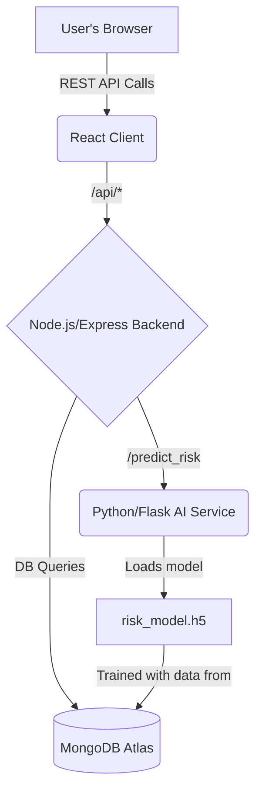

Excellent point. A good `README.md` should anticipate common problems and guide the user through them. Forgetting to create a `.gitignore` is the #1 setup issue for new developers.

I will update the `README.md` to include a specific, prominent section explaining the importance of the `.gitignore` file and why the `venv` and `node_modules` folders must not be committed. This will make the setup process much smoother for anyone cloning your repository.

Here is the revised `README.md` with the new sections. I've marked the new and updated parts for you.

---

# SmartRisk AI: Intelligent Venture Risk Analysis 🚀

**SmartRisk AI** is a data-driven web platform designed to help founders, investors, and accelerators objectively assess the risk profile of early-stage startups. By answering a comprehensive questionnaire, users receive an AI-powered analysis of their venture's risk across four key pillars: Market, Financial, Product, and Team.

The platform provides an overall risk score, actionable suggestions, historical progress tracking, and anonymous benchmarking against other startups in the same industry.

## ✨ Key Features

*   **AI-Powered Risk Scoring:** Utilizes a TensorFlow model to generate a nuanced risk score from 0% to 100%.
*   **Holistic Analysis:** Breaks down risk into four critical startup pillars (Market, Financial, Product, Team).
*   **Historical Progress Chart:** Visually tracks a venture's risk score over time, allowing founders to see their progress as they de-risk their business.
*   **Anonymous Benchmarking:** Compares a user's risk scores against the average for other startups in their industry, providing invaluable context.
*   **Actionable, Integrated Suggestions:** Provides targeted advice based on the highest risk areas, with direct links to an integrated "Founder's Knowledge Base" for deeper learning.
*   **Secure User Authentication:** JWT-based authentication system to manage user accounts and assessment history.

## 🛠️ Tech Stack & Architecture

The project is built on a modern microservice-oriented architecture to separate concerns and ensure scalability.

*   **Frontend:** React, Chakra UI, Chart.js, Axios
*   **Backend (API & Business Logic):** Node.js, Express.js, Mongoose
*   **AI Service (ML Model Serving):** Python, Flask, TensorFlow/Keras, Scikit-learn
*   **Database:** MongoDB Atlas
*   **Authentication:** JSON Web Tokens (JWT)

### System Architecture

The three main services communicate as follows:



1.  The **React Client** provides the user interface.
2.  The **Node.js Backend** handles user authentication, business logic, and is the primary interface to the database.
3.  When a prediction is needed, the Node.js backend calls the **Python AI Service**, which loads the trained TensorFlow model to perform the risk calculation.

## ⚙️ Getting Started: Local Setup

Follow these instructions to get the project running on your local machine.

### Prerequisites

*   **Node.js** (v16 or later)
*   **Python** (v3.8 or later) & `pip`
*   **MongoDB Atlas Account:** You need a free MongoDB Atlas account and your connection string.

### 1. Clone the Repository

```bash
git clone https://github.com/your-username/your-repo-name.git
cd your-repo-name
```

### 2. Configure Environment Variables

**Backend (`/server/.env`):**
Navigate to the `/server` directory and create a `.env` file by copying the example:
```bash
# On Mac/Linux:
cp .env.example .env
# On Windows:
copy .env.example .env
```
Now, edit the new `.env` file and fill in your details:
```ini
# /server/.env

# MongoDB Connection String from Atlas
MONGO_URI=mongodb+srv://<user>:<password>@<cluster-url>/<db-name>?retryWrites=true&w=majority

# Secret for signing JSON Web Tokens
JWT_SECRET=a_very_secret_and_long_string_for_security

# Port for the Node.js server
PORT=5000
```

### 3. Install Dependencies

You'll need to install dependencies for the client, server, and AI service.

```bash
# Install root-level dependencies (for concurrently script)
npm install

# Install server dependencies
cd server
npm install
cd ..

# Install client dependencies
cd client
npm install
cd ..

# Install Python dependencies for the AI service
cd ai_model_service
# Create and activate a virtual environment
python -m venv venv
# On Mac/Linux:
source venv/bin/activate
# On Windows:
.\venv\Scripts\activate
# Install packages
pip install -r requirements.txt
cd ..
```

---
**(Start of Updated Section)**
### ❗ Important Note on `.gitignore`

This project includes a `.gitignore` file at the root to prevent large, unnecessary, or sensitive files from being committed to source control. This is standard practice and critical for project health.

**What is ignored and why?**

*   **/venv/** and **/node_modules/**: These are dependency folders. They can be very large and are specific to your local machine. The `requirements.txt` (Python) and `package.json` (Node.js) files are the "ingredient lists" that allow any developer to recreate these folders perfectly by running `pip install` or `npm install`. **Never commit them.**
*   **`.env`**: This file contains sensitive information like database passwords and secret keys. It should never be shared publicly.
*   **Generated Files (`risk_model.h5`, `scaler.npy`):** The trained AI model and scaler are generated by the `train.py` script. The script itself is the source of truth, not the binary output file.

If you clone this project and see a warning about large files (e.g., `_pywrap_tensorflow_internal.pyd`), it means you may have accidentally tried to commit the `venv` folder. Ensure your `.gitignore` file is in place and that these folders are not tracked by Git.

---
**(End of Updated Section)**

## ▶️ Running the Application

Running the application is a 3-step process due to the nature of the AI model.

### Step 1: Get Sample Data (The "Chicken-and-Egg" Problem)

The AI model needs data to train on, but data is only created when you use the app. We need to create some sample data first.

1.  **Start the Backend & Frontend Servers:**
    *   Open a terminal in the project's **root directory**.
    *   Run the command: `npm run dev-no-ai`
    *   This will start the Node.js server and the React client, but not the Python service.

2.  **Use the App to Create Data:**
    *   Open your browser to `http://localhost:3000`.
    *   Register a new user.
    *   **Submit at least 3-4 different assessments.**
    *   **IMPORTANT:** The risk analysis will fail with an "AI Service Unavailable" error. This is **expected and correct** for this step. The goal is only to save the *answers* to the database.

### Step 2: Train the AI Model

Now that you have sample data in your database, you can train the AI model.

1.  **Stop the running servers (Ctrl+C).**
2.  Open a terminal in the `/ai_model_service` directory.
3.  Make sure your Python virtual environment is activated.
4.  Run the training script:
    ```bash
    python train.py
    ```
5.  This script will connect to your MongoDB, process the answers, train a new model, and save `risk_model.h5` and `scaler.npy` in the `ai_model_service` directory.

### Step 3: Run the Full Application

Now you can run all services together.

1.  Navigate back to the **root directory** of the project in your terminal.
2.  Run the full development script:
    ```bash
    npm run dev
    ```

This command will start the React client, the Node.js backend, and the Python AI service simultaneously. You can now access the fully functional application at `http://localhost:3000`.

## 🔮 Future Improvements

*   **"What-If" Scenario Planner:** Allow users to change answers on the results page to see how it impacts their score in real-time.
*   **Generative AI Suggestions:** Integrate a Large Language Model (e.g., GPT-4) to provide more nuanced, context-aware suggestions based on a combination of risks.
*   **Team Collaboration:** Allow multiple users from the same startup to view and manage their shared assessment history.

## ✍️ Authors

*   **[Vaijayanth HS]**
*   **[Nithin Kumar NS]**
*   **[Rajkamal SP]**